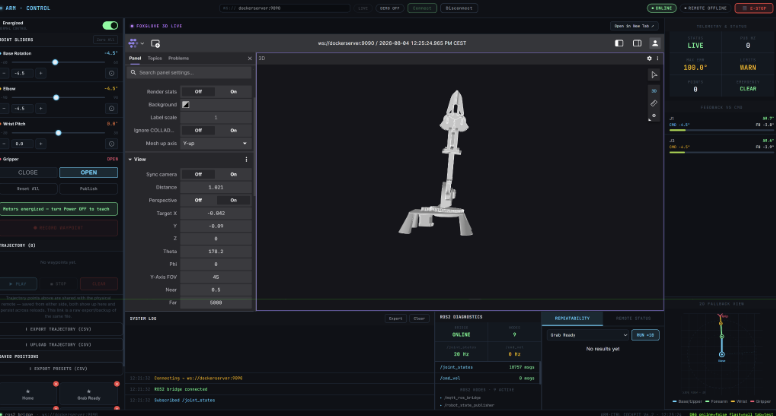

# ARM·CONTROL — 3DOF Teachable Robotic Arm

> A real-time, dual-interface control system for a custom 3D-printed, 3-degree-of-freedom robotic arm. A browser-based dashboard and a synchronized handheld physical remote both operate on one shared robot state, coordinated over a distributed ROS2 / micro-ROS / MQTT architecture. Built to demonstrate closed-loop embedded control, hardware-software integration, and real-time systems engineering.

---

**[Live Demo (Local Simulation Mode)](https://ros2-roboticarm-dashboard.vercel.app/)**

## Overview

ARM·CONTROL is the full control system for a 3DOF robotic arm — base rotation, elbow, and wrist — plus an independently actuated gripper end-effector. It was built as an Embedded Systems Lab final project, and implements four primary capabilities:

| Function | Description |
|----------|-------------|
| **Web Control** | Operate and monitor the robotic arm entirely from a browser: per-joint sliders, live feedback-vs-command comparison, saved presets, and a live 3D visualization. |
| **Teach Mode** | De-energize the stepper joints, manually guide the arm by hand, and record waypoints — combining true encoder feedback (where sensors exist) with commanded servo positions (where they don't) into one consistent pose. |
| **Physical Remote** | A synchronized handheld remote (ESP32-S2, MQTT over WiFi) provides jog control, waypoint saving, and preset triggering. Every action on either interface is reflected on the other in real time — there is exactly one shared source of truth, not two competing ones. |
| **Repeatability Testing** | Run a saved preset automatically for a configurable number of cycles (10+), measuring positional consistency across repeated runs, with error visualization and CSV export. |


*The web dashboard's joint sliders and trajectory controls, running alongside Foxglove's live 3D digital twin of the arm.*

**A note on deployment**: the hardware-connected dashboard is self-hosted over plain HTTP from the Raspberry Pi (via Nginx), because a browser blocks a secure (HTTPS) page from opening an insecure (`ws://`) WebSocket connection — which is exactly what talking to the Pi's rosbridge server requires. A separate **Local Simulation Mode** build has no real WebSocket dependency at all (it runs entirely client-side, with no live hardware connection) and is what's deployed on Vercel, for UI development and demonstration without needing the physical arm.

---

## System Architecture

```text
Browser (React 18 + Vite Dashboard)          Physical Remote (ESP32-S2)
        │                                             │
        │  WebSocket (ws://<pi-host>:9090)            │  MQTT / WiFi
        ▼                                             ▼
rosbridge_websocket (Docker, on Raspberry Pi)   Mosquitto Broker
        │                                             │
        └──────────────► Python MQTT<->ROS2 Bridge ◄──┘
                       (single source of truth for
                     robot state; sole writer of the
                    trajectory.csv / presets.csv files)
                                    │
                                    │  ROS2 Topics
                                    │  (/joint_commands, /joint_states,
                                    │   /gimbal_target, /end_effector_target)
                                    ▼
                        micro-ROS Agent (serial <-> ROS2 DDS)
                                    │  USB / UART
                                    ▼
                     ESP32-S3 (micro-ROS client — closed-loop
                     PID stepper control + PWM servo control)
                                    │
                        ┌───────────┴───────────┐
                        ▼                        ▼
              DRV8825 Drivers              MF90 Servos
              → NEMA17 Steppers            (wrist, gripper)
              → Planetary Gearboxes
                        │
                        ▼
              AS5600 Encoders (output stage,
              analogue mode) → position feedback
                                    │
                                    ▼
                        Foxglove Studio (3D Digital Twin,
                        driven by URDF + robot_state_publisher)
```

All dashboard interactions pass through a single `dispatchCommand()` transport layer rather than talking to ROS2 APIs directly, isolating the UI from the communication mechanism — the transport could in principle be swapped out without touching dashboard logic.

**Why two separate interfaces converge on one process**: rather than letting the dashboard and the remote each write robot state independently (which risks two disagreeing sources of truth), the Python bridge is the *only* thing that ever writes to the persistent CSV files or maintains the "current position" tracking used by both interfaces. See [Software Architecture](#software-architecture) below for exactly how that works.

---

## Hardware

| Component | Detail |
|---|---|
| **Base + Elbow actuation** | 2× NEMA17 stepper motors, each driving a custom 3D-printed planetary gearbox for additional torque |
| **Stepper drivers** | DRV8825 — DIR pin via plain GPIO (static logic level only), STEP pin via hardware PWM (sustained high-frequency switching) |
| **Position feedback** | 2× AS5600 magnetic rotary encoders, analogue-output mode, read via ADC — mounted on each joint's **output stage**, not the motor shaft, specifically to correct for backlash in the printed planetary gearboxes |
| **Wrist + gripper actuation** | MF90 servos (mirrored pair for the gripper; mechanical model has a mounting provision for a 4th servo for increased wrist actuation power) |
| **Motor controller** | ESP32-S3 — runs the micro-ROS client, the PID control loop, and servo control, all non-blocking |
| **Physical remote** | ESP32-S2 — push buttons, I²C-interfaced LCD, deadman switch, hardware-adjacent E-stop trigger |
| **Host compute** | Raspberry Pi — runs the full software stack under Docker Compose |
| **Power** | 24V/3A supply for the stepper motor rail (gated by a physical, hardware-level E-stop switch); servos powered from the same 24V rail via a buck converter to 5V, rather than a second independent supply. High-current and logic-level rails are kept electrically separate, with all rail grounds tied together at one common reference point to prevent stray potential differences across components. |

**Why encoders sit outside the gearbox, specifically**: a gearbox with backlash means the motor shaft's rotation and the joint's real, physical position aren't identical — there's a small amount of dead play between them. An encoder reading the motor shaft directly would be blind to exactly that error. Mounting it on the joint's own output stage means closed-loop correction acts on the real, physical joint angle, backlash included.

---

## Software Architecture

### The Raspberry Pi — Docker Compose stack

The Pi runs seven containers under one Compose file, each with a single, narrow responsibility:

- **ros2-core** — holds a stable ROS2 environment open for diagnostics; runs no functional node itself.
- **rosbridge** — exposes the ROS2 graph over WebSocket (`:9090`) so the browser dashboard can talk to it directly; browsers can't join ROS2's native DDS/UDP-multicast discovery.
- **micro-ros-agent** — bridges the ESP32-S3's serial micro-ROS transport onto the ROS2 DDS graph, acting as a full DDS participant on the microcontroller's behalf.
- **arm-launcher** — builds and runs `robot_state_publisher` from the arm's URDF description, computing the live 3D transform tree Foxglove renders.
- **foxglove-studio** — the 3D visualization panel itself, connected via rosbridge.
- **mqtt-ros-bridge** — the custom Python bridge (see below); the actual center of the whole system.
- A native (non-containerized) **Mosquitto** broker runs as a systemd service on the Pi host, avoiding a port conflict with a second, containerized broker.

This containerized approach was deliberately chosen so the entire stack could be rebuilt deterministically — and in practice, it was migrated wholesale onto a second physical Raspberry Pi with only the Compose file and the built dashboard needing to be copied across.

### The Python MQTT↔ROS2 Bridge

A single `rclpy` process is the actual center of the architecture — the sole translator between MQTT (remote) and ROS2 (everything else), and the sole writer of the two persistent CSV files. It maintains two separate, purpose-specific position-tracking records:

- **Real feedback** — populated *only* by genuine AS5600 sensor readings (base, elbow).
- **Commanded position** — the most recent explicit command from *either* interface, for *every* joint, since the wrist and gripper servos have no position feedback at all.

This split drives three real behaviors:
1. **Dashboard sliders always show commanded position, never live feedback** — showing feedback caused the slider to visibly fight the operator's own input while the motor was still catching up to a new target.
2. **A saved waypoint merges real feedback (where it exists) with commanded position (as fallback)** — so hand-teaching the sensored joints and slider-setting the servo joints in one motion produces one consistent pose.
3. **Playback advances only once real feedback confirms arrival** within a tolerance, rather than trusting a fixed timer.

### Why micro-ROS, specifically

A full ROS2 install depends on a full DDS stack — tens of megabytes of memory footprint at minimum, with its own UDP-multicast peer discovery. An ESP32-S3 has ~512KB of SRAM and no realistic capacity for that, alongside real-time motor control code. micro-ROS closes this gap via the **Micro XRCE-DDS** protocol: the microcontroller runs only a lightweight client, talking over serial to the `micro-ros-agent`, which is the component that actually holds a real DDS participant and performs real discovery *on the microcontroller's behalf*. The result: the ESP32-S3 can publish/subscribe to real ROS2 topics, indistinguishable from any other ROS2 node, without ever running DDS itself.

### Real-Time Behaviour

The system as a whole is **soft real-time** — no single missed deadline constitutes an outright failure, and the architecture is built to tolerate variable timing gracefully. Within that, the ESP32-S3's stepper control loop is the most timing-sensitive component: step generation is offloaded to the ESP32's dedicated LEDC hardware PWM peripheral rather than software GPIO toggling, so pulse timing doesn't compete with the PID loop or the micro-ROS executor for CPU cycles, and doesn't introduce motor stall or audible jitter from unpredictable software timing. This matters concretely in trajectory playback: the arrival-confirmation tolerance had to be set *looser* than the stepper firmware's own internal settling tolerance, since waiting for tighter precision than the control loop itself guarantees would time out every single point.

### Emergency Stop vs. De-energizing

These are deliberately different code paths. De-energizing (`Enable Steppers` off) lets the arm go limp — correct for hand-teaching, where you want to move it freely. **E-Stop does the opposite**: it reads the joints' true current position from the encoders and re-commands that exact position, so the PID loop actively holds the arm rigidly under power. Going limp is the right behavior for teaching; it would be exactly the wrong behavior for a safety stop.

### Units and Naming Translation

- **Radians internally** (ROS2 convention, used in all live messages), **degrees in the persistent CSV files** (for human readability) — conversion happens at exactly two boundary points, not scattered through the codebase.
- **URDF joint naming ≠ internal joint naming.** Following a mechanical redesign (an originally-planned shoulder joint was removed — see Limitations), the CAD tool's auto-generated URDF joint numbering no longer matches the control system's own internal names. This is reconciled via an explicit translation table used *only* when driving the 3D visualization — every other part of the system uses the control system's own stable naming and is unaffected by however the CAD export chooses to number things.

---

## Usage

- **Manual Control** — drag joint sliders or use the remote's jog buttons; both interfaces update live and in sync.
- **Teach Mode** — de-energize the steppers, position the arm by hand, set wrist/gripper via slider, press Record.
- **Playback** — select a saved trajectory and press Play; the system waits for real arrival at each point before advancing.
- **Repeatability Testing** — select a preset, set a cycle count (10+), and run; view positional error and export results as CSV.
- **Emergency Stop** — available on both interfaces; holds the arm rigidly in place under power until explicitly cleared. This is a **soft stop** over WiFi/MQTT/ROS2 — the arm's only unconditional, hardware-level stop is the physical E-stop switch on the 24V rail.

---

## Known Limitations

- Only base and elbow have true position feedback; wrist and gripper are open-loop, so a taught pose for those two joints is only as accurate as the last command sent.
- An originally-planned third stepper-driven shoulder joint was removed after testing showed insufficient motor torque for its real mechanical load.
- The AS5600 encoders run in analogue-output mode rather than I²C, which reintroduces measurable small-scale reading noise even when a joint is stationary — this is why the dashboard shows *commanded* position rather than live feedback.
- The gripper's real mechanical linkage is modeled in the URDF as six coupled joints; the control system treats it as one binary value, so the 3D visualization does not currently animate gripper open/close.
- The software E-Stop is explicitly not a substitute for the hardware E-stop switch on the 24V rail.

See the full project report for a complete discussion of limitations, testing methodology, and possible future improvements (including a discussion of dual-core FreeRTOS task separation on the ESP32-S3 — assessed as a legitimate but *not currently justified* upgrade at the system's present scale).

---

## License

This project is licensed under the MIT License.